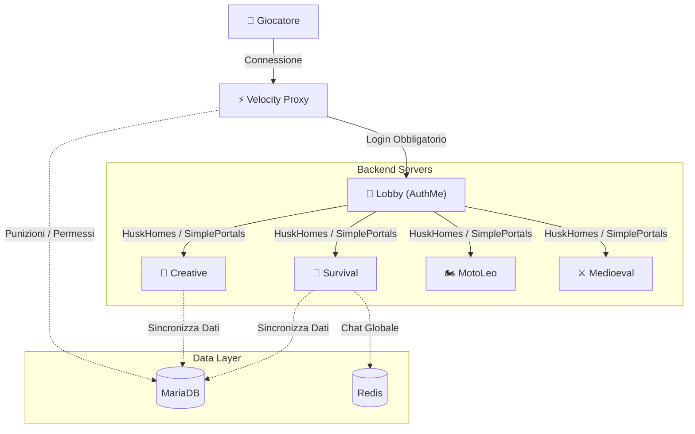
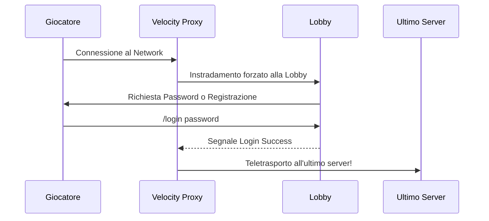
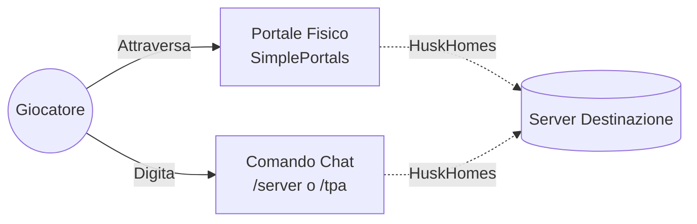

# 📖 Manuale Operativo: MinecraftAdmin Network

> [!TIP]
> Benvenuto nella guida ufficiale! Questo documento è il punto di riferimento per l'amministrazione, i costruttori e i giocatori del network. Qui troverai una mappatura completa dei comandi, le migliori pratiche d'uso e schemi architetturali.

## 📋 Indice dei Contenuti
1. [🗺️ Architettura del Network](#-architettura-del-network)
2. [🛡️ Autenticazione e Profilo (Lobby)](#-1-autenticazione-e-profilo-lobby)
3. [⚖️ Moderazione e Anti-Cheat](#-2-moderazione-e-anti-cheat)
4. [💰 Economia (ExcellentEconomy)](#-3-economia-excellenteconomy)
5. [💬 Chat Sociale](#-4-chat-sociale)
6. [🚀 Movimento e Navigazione](#-5-movimento-e-navigazione)
7. [👑 Ruoli e Permessi (LuckPerms)](#-6-ruoli-e-permessi-luckperms)
8. [🏗️ Territorio (WorldEdit e WorldGuard)](#-7-territorio-worldedit-e-worldguard)
9. [💾 Dati e Backups con HuskSync](#-8-dati-e-backups-con-husksync)
10. [🧠 Intelligenza Artificiale (SentientMobs)](#-9-intelligenza-artificiale-sentientmobs)
11. [🐲 Gestione NPC e Mob Custom](#-10-gestione-npc-e-mob-custom)
12. [📊 Diagnostica e Prestazioni](#-11-diagnostica-e-prestazioni)
13. [⚡ Comandi Essenziali (EssentialsX)](#-12-comandi-essenziali-e-qualità-della-vita-essentialsx)
14. [🎨 Menu Interattivi (zMenu)](#-13-menu-interattivi-zmenu)
15. [🔗 Integrazione di Sistema (Sviluppatori)](#-14-integrazione-di-sistema-avanzata-sviluppatori)

---

## 🗺️ Architettura del Network

Prima di esplorare i comandi, è fondamentale comprendere come il network gestisce i giocatori e i dati dietro le quinte.



> [!IMPORTANT]
> Tutti i database (MariaDB e Redis) vivono in una rete Docker privata. Non esponiamo MAI queste porte all'esterno.

---

## 🛡️ 1. Autenticazione e Profilo (Lobby)

L'ingresso dei giocatori sp (Offline Mode) richiede un sistema solido per proteggere l'identità. Il login è centralizzato esclusivamente nel server **Lobby**.



### Gestione Account (AuthMe)

| Comando | Esecutore | Azione / Descrizione |
| :--- | :--- | :--- |
| `/register <pw> <pw>` | 👤 Giocatore | Registra un nuovo account al primo ingresso. |
| `/login <pw>` | 👤 Giocatore | Effettua l'accesso per giocare. |
| `/changepassword <old> <new>` | 👤 Giocatore | Modifica la password personale. |
| `/authme unregister <giocatore>` | 👑 Admin | Elimina l'account (permette di rifare il setup). |
| `/authme changepassword <utente> <pw>` | 👑 Admin | Forza un cambio password per un utente smarrito. |

### Aspetto e Skin (SkinsRestorer)
Poiché l'account è offline, la skin non si aggiorna automaticamente dai server Mojang.

| Comando | Esecutore | Azione / Descrizione |
| :--- | :--- | :--- |
| `/skin <NomePremium>` | 👤 Giocatore | Imita la skin di un giocatore Premium esistente. |
| `/skin update` | 👤 Giocatore | Ricarica la skin in caso di aggiornamenti. |
| `/skin clear` | 👤 Giocatore | Torna alla skin di default (Steve/Alex). |
| `/sr set <giocatore> <skin>` | 👑 Admin | Assegna forzatamente una skin a qualcuno. |

### Accesso Cross-Play (Geyser & Floodgate)
Il network supporta l'accesso nativo per i giocatori da **Minecraft Bedrock Edition** (Console, Mobile, Windows 10) garantendo piena integrazione.
- Il loro nome in gioco sarà automaticamente preceduto da un asterisco `*` (es. `*Steve`).
- AuthMe è già pre-configurato per accettare questi caratteri speciali. I giocatori Bedrock dovranno semplicemente usare i comandi `/register` e `/login` alla prima connessione, esattamente come gli utenti Java.

---

## ⚖️ 2. Moderazione e Anti-Cheat

> [!WARNING]
> Grazie a **LibertyBans**, qualsiasi sanzione ha un raggio d'azione globale tramite database. Un ban dato nel server "Creative" è effettivo ovunque. Al successivo tentativo di connessione, quando il giocatore atterrerà nel server "Lobby", verrà istantaneamente respinto.

### Punizioni e Controllo

| Comando | Esecutore | Azione / Descrizione |
| :--- | :--- | :--- |
| `/ban <giocatore> [motivo]` | 🛡️ Staff | Banna permanentemente un giocatore (Es: `/ban Marco Griefing`). |
| `/tempban <giocatore> <tempo> [motivo]` | 🛡️ Staff | Banna temporaneamente (Es: `/tempban Marco 2d Uso di Hack`). |
| `/mute <giocatore> [motivo]`| 🛡️ Staff | Silenzia permanentemente il giocatore nella chat globale. |
| `/tempmute <giocatore> <tempo> [motivo]`| 🛡️ Staff | Silenzia temporaneamente il giocatore. |
| `/kick <giocatore> [motivo]` | 🛡️ Staff | Espelle momentaneamente dal network. |
| `/unban <giocatore>` / `/unmute <giocatore>` | 🛡️ Staff | Revoca un ban o un mute precedentemente assegnato. |
| `/history <giocatore>` | 🛡️ Staff | Apre una dashboard GUI (interfaccia) con lo storico sanzioni. |
| `/alts <giocatore>` | 🛡️ Staff | Cerca account connessi dallo stesso IP per prevenire elusioni. |

### Sicurezza (BetterGrim)
Nessun comando necessario! L'anticheat agisce in modo passivo e asincrono per prevenire cheat (Speed, Killaura) bloccando le iterazioni a livello di protocollo.

> [!TIP]
> **Protezione GeoIP (AuthMe)**
> La Lobby analizza automaticamente l'indirizzo IP dei giocatori confrontandolo con un database GeoIP aggiornato automaticamente a ogni deploy, fornendo una barriera extra contro bot e account esteri sospetti.

---

## 💰 3. Economia (ExcellentEconomy)

L'economia è persistente, asincrona e unificata su database MySQL. I portafogli viaggiano da server a server senza lag o de-sync.

| Comando | Esecutore | Azione / Descrizione |
| :--- | :--- | :--- |
| `/money` o `/balance` | 👤 Giocatore | Visualizza il saldo bancario attuale. |
| `/pay <giocatore> <importo>` | 👤 Giocatore | Dona denaro a un altro utente in qualsiasi server. |
| `/baltop` | 👤 Giocatore | Mostra la classifica generale dei più ricchi della rete. |
| `/eco set <giocatore> <importo>` | 👑 Admin | Inizializza un saldo preciso. |
| `/eco give <giocatore> <importo>`| 👑 Admin | Genera e accredita fondi artificialmente. |

---

## 💬 4. Chat Sociale

La chat è potenziata da **RedisChat**, garantendo una comunicazione fluida senza barriere fisiche tra i server.

| Comando | Esecutore | Azione / Descrizione |
| :--- | :--- | :--- |
| `[messaggio diretto]` | 👤 Giocatore | Parla nella chat Pubblica (visibile in *tutti* i server). |
| `/msg <utente> <messaggio>` | 👤 Giocatore | Messaggio privato (PM). |
| `/r <messaggio>` | 👤 Giocatore | Risponde automaticamente all'ultimo utente che ti ha scritto in privato. |
| `/ignore <utente>` | 👤 Giocatore | Nasconde i messaggi di un utente per il tuo account. |
| `/mail` | 👤 Giocatore | Sistema di posta elettronica interna per chi è temporaneamente offline. |

---

## 🚀 5. Movimento e Navigazione



### Spostamenti Diretti (HuskHomes)

| Comando | Esecutore | Azione / Descrizione |
| :--- | :--- | :--- |
| `/server <nome>` | 👤 Giocatore | Viaggia istantaneamente. Esempio: `/server survival`. |
| `/tpa <giocatore>` | 👤 Giocatore | Chiede di teletrasportarsi verso il giocatore (cross-server). |
| `/tpaccept` | 👤 Giocatore | Accetta la richiesta TPA. |
| `/tp <giocatore>` | 👑 Admin | Teletrasporto silenzioso bypassando le richieste. |

### 🌀 Come Creare un Portale Fisico (Guida Passo-Passo)

Vuoi creare un bellissimo portale (ad esempio con l'acqua o particelle) che trasporti automaticamente i giocatori in un altro server del network (es. dalla Lobby al Survival)? 
Segui questi semplici passi! Usiamo il plugin **SimplePortals**.

**Passo 1: Costruisci la struttura visiva**
Costruisci la "cornice" del tuo portale usando i blocchi che preferisci (es. Ossidiana, Quarzo, Vetro). Lascia vuoto lo spazio al centro dove i giocatori dovranno camminare. Se vuoi, puoi riempire lo spazio interno con acqua, lava o ragnatele: il portale funzionerà ugualmente!

**Passo 2: Prendi lo strumento magico (Wand) del plugin**
Scrivi in chat il comando:
`/portal wand`
Riceverai uno strumento speciale dedicato ai portali. Serve per selezionare l'area invisibile che fungerà da innesco.

**Passo 3: Seleziona l'area magica di ingresso**
Devi selezionare l'angolo in basso a sinistra e l'angolo in alto a destra dello spazio "vuoto" del tuo portale (esattamente lo spazio volumetrico in cui il giocatore passerà):
1. Guarda il blocco del **primo angolo** (es. in basso a sinistra) e fai **Click Sinistro** con lo strumento.
2. Guarda il blocco dell'**angolo opposto** (es. in alto a destra, nella profondità opposta) e fai **Click Destro** con lo strumento.

*(Nota: Hai appena creato un parallelepipedo invisibile che fa da sensore per il tuo portale).*

**Passo 4: Attiva il teletrasporto verso il Server**
Ora che l'area è selezionata, scrivi il comando per trasformare quello spazio nel vero e proprio portale di connessione.
Sintassi base: `/portal create desti:<ServerDiDestinazione>`

*Opzionale:* Il plugin permette anche di specificare il blocco che riempirà automaticamente il portale aggiungendo `block:<TIPO>`. Ad esempio: `block:WATER`, `block:LAVA` o `block:NETHER_PORTAL`.

**Esempi pratici:**
- Per fare un portale vuoto verso il server Survival: `/portal create desti:survival`
- Per fare un portale ad acqua verso il Creative: `/portal create desti:creative block:WATER`

**Fatto! 🎉**
Prova ad attraversare fisicamente l'area: verrai magicamente e fluidamente trasportato nel server di destinazione senza dover digitare alcun comando aggiuntivo!

**Gestione Emergenze:**
- Se hai sbagliato a creare il portale, selezionalo di nuovo o guardalo e rimuovilo con: `/portal remove`
- Per visualizzare le aree dei portali esistenti vicino a te: `/portal show`

---

## 👑 6. Ruoli e Permessi (LuckPerms)

Il motore centrale della gerarchia (VIP, Helper, Mod, Admin) gestisce l'accesso **a livello di rete Proxy (Velocity)**.
> [!WARNING]
> LuckPerms in questa architettura è posizionato sul nodo Velocity e regola l'ingresso e i comandi proxy (es. `/skin`). Non governa i comandi dei server backend (come `/god`, `/mm` o WorldEdit). Per avere il totale controllo nei vari mondi, il giocatore Admin deve essere reso `OP` (Operatore) nei singoli nodi backend, scavalcando di fatto ogni restrizione.

> [!TIP]
> **Come usare il Web Editor (Fortemente Consigliato)**
> Non perdere tempo con mille comandi in chat. Digita `/lp editor`. Il plugin ti darà un link univoco; aprilo sul browser, usa la comoda interfaccia grafica per trascinare ruoli e aggiungere permessi, poi premi Salva. Otterrai un comando che inizierà per `/lp apply <hash>`, incollalo su Minecraft e le modifiche diverranno effettive all'istante!

| Comando di Base | Azione |
| :--- | :--- |
| `/lp user <giocatore> parent set <rank>` | Sostituisce il ruolo principale dell'utente. |
| `/lp user <giocatore> permission set <nodo>` | Assegna un permesso secco a un utente. |
| `/lp group <rank> meta setprefix <stringa>` | Personalizza le tag VIP/Admin visibili in TAB e Chat. |

---

## 🏗️ 7. Territorio (WorldEdit e WorldGuard)

Strumenti indispensabili per lo Staff (Builder/Mod).

### Terraformazione in Massa (WorldEdit)
| Comando | Azione / Descrizione |
| :--- | :--- |
| `//wand` | Ricevi lo strumento di selezione. |
| `//set <blocco>` | Riempie interamente la selezione geometrica. |
| `//replace <id1> <id2>`| Trasforma tutti i blocchi `id1` nell'area in `id2`. |
| `//undo` | Annulla (salva la vita in caso di errore disastroso!). |

### Protezione Zone (WorldGuard)
| Comando | Azione / Descrizione |
| :--- | :--- |
| `/rg define <nome_zona>` | Dichiara la zona selezionata (con ascia) protetta dal griefing. |
| `/rg flag <zona> pvp deny` | Proibisce il ferimento e il combattimento lì dentro. |
| `/rg flag <zona> mob-spawning deny` | Nessun mostro può apparirvi naturalmente. |
| `/rg addmember <zona> <utente>` | Concede solo all'utente indicato il permesso di rompere blocchi in quella zona. |

---

## 💾 8. Dati e Backups con HuskSync

HuskSync è vitale per trasportare XP, inventari, e vita da un server Backend all'altro senza creare loop di cloni.

> [!CAUTION]
> Maneggiare l'inventario degli altri è sensibile e impatta l'esperienza di gioco. Fallo solo per scopi diagnostici e di moderazione.

| Comando | Azione / Descrizione |
| :--- | :--- |
| `/husksync invsee <giocatore>` | Apre l'inventario live del giocatore (funziona anche se il giocatore non è in game!). |
| `/husksync echest <giocatore>` | Visualizza l'EnderChest globale dell'utente. |
| `/husksync restore <giocatore>` | Visualizza tutti gli **snapshot (backup orari e alla morte)** dell'utente. Consente a un Admin di ripristinare il setup se il giocatore è stato vittima di glitch o grief letali. |

---

## 🧠 9. Intelligenza Artificiale (SentientMobs)

I mob ostili in questo network non sono stupidi! Grazie a **SentientMobs**, l'AI base di Minecraft viene rimpiazzata con comportamenti situazionali avanzati (coordinamento per chiamare rinforzi, ritirate strategiche e tattiche di combattimento di gruppo). 

Il plugin opera passivamente senza richiedere grandi azioni da parte dei giocatori, ma offre alcuni comandi per lo staff.

| Comando | Esecutore | Azione / Descrizione |
| :--- | :--- | :--- |
| `/sm createlang <lingua>` | 👑 Admin | Crea un template di lingua in `plugins/SentientMobs/lang/` per tradurre l'interfaccia o personalizzare i nomi. |
| `/sm setlang <lingua>` | 👑 Admin | Cambia la lingua attiva al volo (es. `it-IT`). |

---

## 🐲 10. Gestione NPC e Mob Custom

Per popolare i mondi con personaggi non giocanti (NPC) interattivi o boss personalizzati, il server si avvale di **Citizens2** e **MythicMobs**.

### Citizens (Creazione NPC)
> [!WARNING]
> A causa di limitazioni di sicurezza nel download automatico di Citizens, l'amministratore **deve** scaricare manualmente il file `Citizens-*.jar` ufficiale e inserirlo nella cartella locale `custom-plugins/`. Successivamente, lanciando `./deploy.sh --server`, il plugin verrà installato su tutti i nodi e i comandi si abiliteranno.

Gli NPC sono utilissimi per fare da mercanti, guide o ologrammi viventi negli spawn.

| Comando | Esecutore | Azione / Descrizione |
| :--- | :--- | :--- |
| `/npc create <Nome>` | 👑 Admin | Crea un NPC nel punto in cui ti trovi. |
| `/npc sel` | 👑 Admin | Seleziona l'NPC che stai guardando per modificarlo. |
| `/npc type <tipo>` | 👑 Admin | Cambia il tipo di entità (es. `villager`, `zombie`, `skeleton`). |
| `/npc skin <NomePremium>` | 👑 Admin | Cambia la skin dell'NPC selezionato. |
| `/npc equip` | 👑 Admin | Apre l'editor per vestire l'NPC e dargli oggetti in mano. |
| `/npc text` | 👑 Admin | Permette di aggiungere frasi che l'NPC dirà quando ci si avvicina o si clicca. |
| `/npc remove` | 👑 Admin | Elimina l'NPC selezionato. |

### MythicMobs (Boss e Mob Custom)
MythicMobs permette di creare nemici formidabili con abilità, magie e drop unici.  
Puoi creare, modificare ed eliminare graficamente le tue entità direttamente dal **Web Panel** (nella sezione Editor Mostri/Oggetti/Abilità).
Per esplorare la sterminata lista di parametri e funzionalità supportate da questo plugin, consulta la **Documentazione Ufficiale**: [https://git.mythiccraft.io/mythiccraft/MythicMobs/-/wikis/home](https://git.mythiccraft.io/mythiccraft/MythicMobs/-/wikis/home)

> [!TIP]
> **Editor Visuale per i Mob!**
> Non impazzire scrivendo a mano righe di codice YAML se non vuoi! Dal **Pannello di Controllo Web**, recati nella sezione "Mobs". Li troverai un **Editor Visuale** guidato che ti permetterà di configurare con drop-down, caselle di controllo e campi numerici tutta la base dei tuoi mostri: restrizioni vanilla, movimento, barra della salute (BossBar) personalizzata e stato visivo. Il pannello riformatterà e sincronizzerà tutto in automatico!

> [!TIP]
> **Architettura Globale!** Tutti i mob, le abilità e gli oggetti creati con MythicMobs sono condivisi e sincronizzati in tempo reale su **tutti** i server (Lobby, Survival, Creative, ecc.) tramite volumi Docker centralizzati. Puoi spawnare qualsiasi boss in qualsiasi mondo!

| Comando | Esecutore | Azione / Descrizione |
| :--- | :--- | :--- |
| `/mm m spawn <NomeMob>` | 👑 Admin | Spawna un mob custom definito nei file di configurazione (`plugins/MythicMobs/Mobs/`). |
| `/mm i get <NomeItem>` | 👑 Admin | Ottieni un oggetto magico/custom creato con MythicMobs. |
| `/mm s create <NomeSpawner> <NomeMob>` | 👑 Admin | Crea un punto di spawn automatico nel blocco che stai guardando. |
| `/mm s set <NomeSpawner> warmup <secondi>` | 👑 Admin | Modifica il tempo di ricarica dello spawner. |
| `/mm reload` | 👑 Admin | Ricarica le configurazioni (utile dopo aver modificato i file YAML). |

#### 👹 Lista Mob Custom Attualmente Disponibili
Di seguito la lista di tutti i boss e mob personalizzati pronti per essere spawnati (via comando o spawner) nel network:

| Nome Interno (`<NomeMob>`) | Descrizione / Caratteristiche | Difficoltà |
| :--- | :--- | :--- |
| `SkeletalKnight` | Cavaliere Wither con armatura in ferro e scudo. Droppa monete d'oro. | Media |
| `SkeletonKing` | **Boss!** Evoca minion, dialoga in chat e sferra attacchi esplosivi "Smash" letali. | Alta 💀 |
| `SkeletalMinion` | Semplice scheletro gregario evocato dal Re. | Bassa |
| `StaticallyChargedSheep` | Pecora immune ai fulmini che lancia dardi elettrici a chiunque le stia vicino. | Media |
| `AngrySludge` | Slime gigante formidabile che emette onde circolari velenose ad area. | Alta |
| `PurgeTitan` | **Evento di Purificazione!** Un Titano Gigante che evoca un'orda (25+) di Cacciatori Epuratori che eliminano tutti i mostri nel raggio. Dopo 60s si auto-distrugge con il suo esercito. | Estrema ☠️ |

---

## 📊 11. Diagnostica e Prestazioni

| Plugin / Tool | Comando | Utilizzo Principale |
| :--- | :--- | :--- |
| **spark** | `/spark profiler start` | Registra e profila il consumo RAM e CPU (generando link interattivi allo `stop`). Usalo in caso di Lag. |
| **BlueMap** | `/bluemap render prioritize <mondo>` | Aggiorna forzatamente la mappa 3D accessibile dal Web Panel per riflettere le nuove costruzioni. |

---

## ⚡ 12. Comandi Essenziali e Qualità della Vita (EssentialsX)

Molti dei classici comandi "Vanilla" potenziati o comandi di comodità per lo Staff sono forniti dal motore **EssentialsX**. Se sei Admin o OP, questi comandi ti semplificheranno la vita ovunque nel network.

| Comando | Esecutore | Azione / Descrizione |
| :--- | :--- | :--- |
| `/god` | 👑 Admin | Rende il giocatore invulnerabile a qualsiasi danno. |
| `/fly` | 👑 Admin | Permette di volare anche nella modalità Sopravvivenza. |
| `/heal [giocatore]` | 👑 Admin | Cura completamente la vita e riempie la fame. |
| `/feed [giocatore]` | 👑 Admin | Sazia istantaneamente il giocatore. |
| `/speed <velocità>` | 👑 Admin | Aumenta o diminuisce la velocità di volo/corsa (es. `/speed 2`). |
| `/invsee <giocatore>`| 👑 Admin | In alternativa a HuskSync, permette la manipolazione veloce. |
| `/vanish` o `/v` | 👑 Admin | Rende l'admin completamente invisibile agli altri giocatori. |

---

## 🎨 13. Menu Interattivi (zMenu)

Il network utilizza **zMenu** per fornire interfacce grafiche sia su Java (tramite GUI tradizionali ad inventario) sia su Bedrock (tramite **Bedrock Forms** native, grazie all'integrazione con Floodgate). I menu sono sincronizzati globalmente tra tutti i server.

| Comando | Esecutore | Azione / Descrizione |
| :--- | :--- | :--- |
| `/zmenu open <nome_menu>` | 👤 Giocatore | Apre a schermo il menu specificato (es. `hub_menu`). |
| `/zmenu reload` | 👑 Admin | Ricarica istantaneamente le configurazioni dei menu senza riavviare il server. |

---

## 🔗 14. Integrazione di Sistema Avanzata (Sviluppatori)

Il network sfrutta **Vault-Updated**, **ExcellentEconomy** e **PlaceholderAPI (PAPI)** come collante universale tra i vari sistemi. Questa architettura permette a scoreboard, script custom e NPC di comunicare con il portafoglio globale dei giocatori in tempo reale e in modo sicuro.

### 14.1. Integrazione PAPI per TAB e Scoreboard
Il proxy monta `TAB` e `VelocityScoreboardAPI`. Per far visualizzare dinamicamente il saldo bancario o il ruolo di LuckPerms ai giocatori, si usano i seguenti _placeholders_:

- **Saldo dell'Economia:** `%vault_eco_balance_formatted%` o `%vault_eco_balance%`
- **Gruppo LuckPerms:** `%luckperms_primary_group_name%`
- **Prefisso Chat:** `%luckperms_prefix%`

Affinché `TAB` legga questi valori nativamente dal backend, assicurati di aver scaricato i moduli PAPI nei server backend (Lobby, Survival, ecc.) tramite console:
`/papi ecloud download Vault`
`/papi ecloud download LuckPerms`
`/papi reload`

### 14.2. NPC Bancari e Comandi tramite Citizens
Un'applicazione molto pratica degli NPC di Citizens è trasformarli in entità bancarie interattive. Invece di far digitare comandi ai giocatori (difficile da console o smartphone), puoi associare un comando all'NPC al clic.

**Procedura per creare un NPC "Banchiere":**
1. Crea l'NPC: `/npc create Banchiere`
2. Assicurati che sia selezionato: `/npc sel`
3. Aggiungi il comando al click destro: `/npc command add -p balance`

Il flag `-p` fa sì che il comando venga eseguito "come se lo avesse digitato il giocatore" (player context), eseguendo nativamente `/balance` e mostrando il saldo all'utente che lo ha cliccato.

### 14.3. Integrazione Skript e Database Asincrono
Skript può leggere l'economia globale senza dover creare logiche custom di salvataggio. Usando l'integrazione nativa Skript-Vault, il bilancio è esposto come l'espressione `player's balance`. Qualsiasi modifica fatta via Skript aggiornerà immediatamente il database MySQL di ExcellentEconomy in modo thread-safe.

**Esempio Pratico: Creare un Cartello Bancomat con Skript**
Salva questo snippet in `plugins/Skript/scripts/bancomat.sk`:
```skript
on right click on a sign:
    if line 1 of event-block is "[Bancomat]":
        if player's balance >= 100:
            remove 100 from player's balance
            give player 1 of gold ingot named "§eLingotto d'Oro Prelevato"
            send "§aHai prelevato con successo 100$!" to player
        else:
            send "§cNon hai fondi sufficienti sul tuo conto globale." to player
```
Poiché l'economia è gestita globalmente da ExcellentEconomy su MySQL, questa transazione Skript in "Lobby" o in "Survival" è istantaneamente sincronizzata con il Proxy e gli altri mondi.

